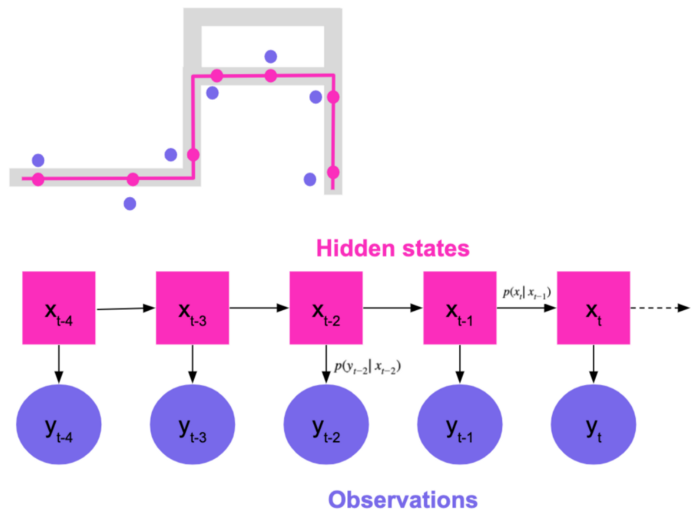
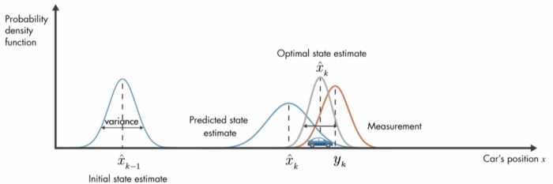

# Connected Car: Architecture, Performance
-------------

# 1. Giới thiệu 
- `Connected Car` (tên thương mại: `VCar`) là ứng dụng được xây dựng hướng tới là trợ lý cho người lái xe.
- Các chức năng chính:
    - (**) Theo dõi thông số xe theo thời gian thực. Bao gồm: vị trí, tốc độ vòng quay, nhiệt độ nước làm mát, điện áp ắc quy
    - (***) Cảnh báo vượt tốc độ, nhắc biển báo phía trước
    - (*) Ghi nhận các hành vi lái xe không an toàn và tính điểm lái xe (cua gấp, tăng tốc đột ngột, vượt tốc độ quy định theo biển báo)
    - (**) Ra vào fence cá nhân 
    - (*) Thống kê lịch sử hành trinh theo thời gian
    - (*) Theo dõi và đẩy cảnh báo về xe: xe có mã lỗi, ắc quy yếu, hoặc các thông số bất thường về xe.
    - (**) Nhắc các sự cố giao thông trên cung đường nếu có 

- Các thức hoạt động:

    - Thiết bị OBD cắm vào cổng OBD2 trên xe, thu thập thông tin xe (vị trí, nhiệt độ nước làm mát, tốc độ vòng quay, vân vân)
    - Thiết bị xử lý và gửi thông tin về hệ thống qua sim 4G, theo chu kỳ lấy mẫu khoảng 5s/bản tin khi xe chạy, và 60 phút/lần khi xe dừng.
    - Hệ thống ghi nhận bản tin, lưu trữ, thực hiện kiểm tra các điều kiện, đẩy cảnh báo/thông báo theo thời gian thực (nếu có)

-------
# 2. Kiến trúc

### Kiến trúc

- Xương sống là nền tảng Thingsboard.
- Gateway: thành phần giao tiếp device tự phát triển
- Rule Engine: thực hiện điều hướng bản tin, các nghiệp vụ cụ thể (cảnh nhiệt độ, kiểm tra vào ra geo-fence, )
- Các nghiệp vụ nặng hơn đẩy thành các webservices, co giãn theo nhu cầu. Ví dụ: kiểm tra vượt tốc
- DB lưu các cấu hình là Postgres, các bản tin thiết bị đẩy lên lưu vào Cassandra.


### Rule engine của 1 số thành phần quan trọng

#### Root rule chain


#### Personal fence


#### Overspeed chain


#### Maxspeed Sign chain
 

#### Overheed chain


#### Low voltage ignition on/off

Ignition off


Ignition on


-----
# 3. Benchmark 

## 3.1 Thông số và cách đo:

| Thông số| Cách đo |
|----------|-------------|
| Thời gian matching bản tin GPS vào đường | Tính từ lúc webservice nhận được bản tin, tới khi bản tin được xử lý xong (matching, tìm biển), sẵn sàng đẩy sang các notification service khác (`firebase`, `mqtt`, etc)
| Thời gian end-to-end (chỉ để benchmark chức năng speed-check) | Từ lúc gateway nhận bản tin -> xử lý xong (matching, tìm biển) & sẵn sàng đẩy sang các notification service khác  |
| Thời glan lưu trữ xuống DB (Cassandra) | Tính từ lúc nhận bản tin (thời gian do gateway đánh dấu vào trường `ts` của bản tin), tới khi lưu thành công xuống cassandra (sử dụng `writetime` của bản tin do Cassandra đánh tự động khi ghi bản tin) |


## 3.2 Kết quả đo

### Đo toàn trình, đầy đủ tính năng:

### 2500 devices
```
Thời gian matching 1 bản tin:
* Trung bình: 16.946 ms
* P95: 37 ms
* P99: 62 ms

Thời gian e2e:
* P95: 1443 ms
* P99: 2145 ms

Cassandra latency:
* Avg : 442 ms
* P95: 1093 ms
* P99: 1701 ms
```

### 3000 devices

```
Thời gian matching 1 bản tin:
* Trung bình: 17.174
* P95: 37 ms
* P99: 60 ms

Thời gian e2e:
* P95: 2399 ms
* P99: 10969 ms

Cassandra latency:

* Avg: 642 ms
* P95: 1642 ms
* P99: 2665 ms
```

### 3500 devices:

```
Thời gian matching 1 bản tin:
* Trung bình: 17.669
* P95: 37 ms
* P99: 88 ms

Thời gian e2e:
* P95: 4817 ms
* P99: 18185 ms

Cassandra latency:

* Avg : 847 ms
* P95: 2434 ms
* P99: 5254 ms
```

### B. Chỉ đo luồng giải mã, và lưu trữ. Tắt hết chức năng cảnh báo vượt tốc, bất thường ắc quy, geo-fence cá nhân.

### 20K devices 
```
Cassandra latency:
* Avg: 590 ms
* P95: 1300 ms
* P99: 9800 ms
```

### 10K devices 
```
Cassandara latency: 
* Avg: 170 ms
* P95: 303 ms
* P99: 800 ms 
```

# 5. Tài nguyên 

### Overall

| Pods | CPU – Request    | CPU – Limit      | RAM    | Storage |  | Tổng CPU | Tổng Memory |
|------|------------------|------------------|--------|---------|--|----------|-------------|
| 271  | 522.5            | 862              | 1764.9 | 24690   |  | 772      | 3000        |
|      | *68%* | *112%* | *58%* |         |  |          |             |

<br>
<br>

### Chi tiết các thành phần

| Deployments                      | Pods | CPU-Request | CPU-Limit | RAM (GB) | Storage (GB)|
|----------------------------------|------|-------------|-----------|------|---------|
|                                  |      |             |           |      |         |
| Cassandra                        | 12   | 15          | 15        | 62   | 1024    |
| Postgresql                       | 6    | 4           | 6         | 12   | 512     |
| Postgresql - Connection Pool     | 4    | 0.5         | 1         | 0.1  |         |
| Kafka                            | 7    | 4           | 6         | 12   | 512     |
| Redis Cluster – Thingsboard      | 6    | 1           | 1         | 4.5  | 20      |
| Redis Sentinel – Onroad          | 3    | 1           | 1         | 9    | 40      |
| Minio                            | 8    | 1           | 1         | 8    | 512     |
| Elasticsearch                    | 3    | 3           | 3         | 12   | 300     |
| Prometheus                       | 2    | 1           | 2         | 16   | 200     |
|                                  |      |             |           |      |         |
| Barefoot Map                     | 2    | 2           | 2         | 8    |         |
| Onroad Speed Check               | 20   | 3           | 6         | 8    |         |
| OSRM                             | 2    | 2           | 2         | 8    |         |
| AGPS-Proxy                       | 2    | 0.25        | 0.25      | 0.5  |         |
| Gosun Gateway                    | 8    | 1.25        | 5         | 5    |         |
| Onroad Admin API                 | 2    | 0.25        | 1         | 1    |         |
| Onroad Core Api                  | 2    | 0.5         | 2         | 4    |         |
| Onroad Customer Care API         | 2    | 0.25        | 1         | 1    |         |
| Onroad Management UI             | 2    | 0.25        | 1         | 0.5  |         |
| Onroad Geocoding                 | 2    | 0.25        | 1         | 0.5  |         |
| Onroad Internal Service          | 2    | 0.25        | 1         | 0.5  |         |
| Onroad Notification Service      | 5    | 0.5         | 2         | 4    |         |
| Onroad TripStats                 | 5    | 0.5         | 2         | 1    |         |
| Onroad Vehicle Compatibility API | 2    | 0.25        | 1         | 0.5  |         |
| Thingsboard Javascript Executor  | 100  | 0.5         | 2         | 0.25 |         |
| Thingsboard Core                 | 5    | 2           | 2         | 8    |         |
| Thingsboard HTTP Transport       | 5    | 0.25        | 1         | 3    |         |
| Thingsboard MQTT Transport       | 10   | 0.25        | 1         | 3    |         |
| Thingsboard Rule Engine          | 30   | 3           | 3         | 6    |         |
| Onroad Reverse Geocoding         | 2    | 4           | 4         | 16   | 30      |
| Zookeeper                        | 5    | 0.25        | 0.5       | 0.5  | 10      |
| Nginx Ingress                    | 5    | 2           | 8         | 16   |         |

<br>

# 6. Các việc đã làm

- Tự viết 1 số RuleNode riêng cho ứng dụng VCar, mà không dùng 1 số mặc định của thingsboard + customer logic với javascript. Việc này khiến tác vụ lặp lại nhiều lần được thực hiện với code Java mà không cần chạy với javascript, và bỏ qua thời gian gửi task tới các JSEXecutor. Ví dụ: routing messsage, convert/format định dạng bản tin. (Kết quả thay đổi rõ ràng, tuy nhiên ko ghi lại journal nên có so sánh)
  
- Tinh chỉnh Kafka producer cho Thingsboard, chỉnh `linger.ms` xuống `50 ms`. Chỉnh `READ/WRITE CONSISTENCY LEVEL` cho Cassandra là `ONE` 

=> Kết quả thời gian toàn trình bản tin giảm khoảng 1s. (P95  từ 2.8s xuống 1.8s với bài test cho  2500 xe)

- Chỉnh tham số đầu vào cho thuật toán `Realtime map matching` cho phù hợp với sai số GPS thực tế (tối đa 70m ở các đoạn bị che chắn nhiều). Lọc bớt các GPS gần nhau về thời gian và vị trí. Qua đó giảm số lượng điểm cần quét, giảm số lượng phép tính cần tính, giảm số lượng query cần thực thi. Kết quả khả năng xử lý của thuật toán Speed-check tăng 30%.


# 7. Thuật toán và các tham khảo liên quan

- [Tài liệu mô tả Realtime map matching của Vcar](./algo/vcar_matching_realtime.pdf)

- [Map matching realtime source code (redacted)](https://github.com/thucdx/or-tracker)

- [Giới thiệu chi tiết thuật toán gốc sử dụng HMM](./algo/Hidden-Markov-Map-Matching-Through-Noise-and-Sparseness-ACM-SIGSPATIAL-2009-final.pptx)


- [Realtime map matching tại Uber sử dụng HMM với p95: 4.63ms, p99:14.08 ms](https://www.youtube.com/watch?v=ChtumoDfZXI)
  

- Lyft cải tiến từ HMM sang dùng Uncented Kalman filter, tuy nhiên không công bố benchmark cụ thể. [A new Realtime map-matching algorithm at Lyft](https://eng.lyft.com/a-new-real-time-map-matching-algorithm-at-lyft-da593ab7b006)
